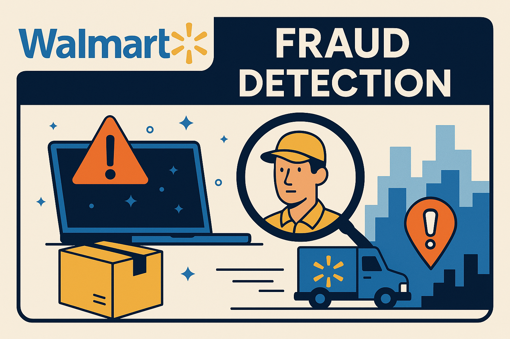

# Projeto de Detecção de Fraudes nas Entregas do Walmart

## Visão Geral e Contexto do Problema

O aumento expressivo das compras online nos últimos anos trouxe grandes benefícios para empresas e consumidores, mas também revelou vulnerabilidades operacionais, especialmente nos processos de entrega. Empresas de grande porte, como o Walmart, enfrentam desafios crescentes relacionados à confiabilidade da entrega, perdas logísticas e fraudes.

Fraudes em entregas ocorrem quando há inconsistências entre o que foi enviado e o que o cliente declara ter recebido, podendo envolver motoristas, clientes ou falhas sistêmicas. Esses eventos geram prejuízos financeiros, perda de confiança dos clientes e aumento de custos operacionais. 

Este projeto busca entender a origem dessas falhas a partir de um conjunto de dados reais da operação do Walmart na região Central da Flórida. Utilizando técnicas de ciência de dados, foi possível extrair padrões de comportamento, identificar atores recorrentes em falhas e propor soluções com embasamento técnico e estatístico.

## Introdução

Este projeto tem como objetivo aplicar ciência de dados para detectar, analisar e mitigar ocorrências de fraudes em entregas realizadas pelo Walmart na região Central da Flórida. A iniciativa se apoia em um conjunto de dados realistas, técnicas estatísticas, machine learning e estratégias de visualização de dados para propor soluções concretas e baseadas em evidências.

A estrutura do projeto está organizada da seguinte forma:

- `Notebooks/`: Contém os Jupyter Notebooks utilizados para cada etapa da análise (EDA, modelagem, avaliação, etc.).
- `Dados/`: Inclui os arquivos CSV com os dados brutos.
- `Database/`: Armazena a base de dados em SQLite utilizada para realizar consultas SQL e cruzamentos entre tabelas.
- `Documentação/`: Textos de apoio e descrições técnicas.
- `Relatório/`: Versões PDF e Markdown do relatório completo.
- `Dashboard/`: Dashboard desenvolvido em Power BI para análise interativa.

Todos os scripts estão comentados e versionados para facilitar a reprodutibilidade.

---

## Etapas da Análise

### 1. Análise Exploratória dos Dados (EDA)

- Análise das tabelas: `orders`, `drivers`, `customers`, `missing_items`, `products`.
- Verificação de dados ausentes e integridade relacional entre IDs.
- Identificação de regiões e horários com maior volume de reclamações (ex.: Altamonte Springs, Apopka e período da madrugada).
- Análise de recorrência entre motoristas e clientes com falhas.
- Combinação via SQL de múltiplas tabelas para cruzar entregas, itens não recebidos e perfis de motoristas.

### 2. Detecção de Padrões de Fraude

- Aplicação de Isolation Forest e Random Forest para detectar entregadores com padrões fora da curva.
- Análise de divergência entre itens entregues e recebidos.
- Clusterização de motoristas reincidentes por métricas de comportamento.
- Destacam-se motoristas como Dana Ferguson e Daniel Hall, com altas taxas de pedidos problemáticos.

### 3. Avaliação de Causas e Responsabilidades

- Regiões críticas identificadas: Altamonte Springs e Apopka.
- Horários com maior taxa de falha: entre 0h e 5h.
- Produtos mais visados: Chicken Breast, Peanut Butter, Ground Coffee.
- Clientes e motoristas reincidentes apontados como possíveis causadores de fraudes recorrentes.
- Evolução temporal indica crescimento dos casos com o tempo.

---

## Recomendações e Medidas Preventivas

| Medida                            | Justificativa                                                       | Estimativa de Redução |
|----------------------------------|----------------------------------------------------------------------|------------------------|
| Validação com foto               | Comprovação visual no momento da entrega                            | 12–18%                 |
| QR Code dinâmico vs PIN          | Autenticação segura e exclusiva por pedido                          | 8–12%                  |
| Auditoria de motoristas          | Foco em reincidentes com alta taxa de falha                         | 6–10%                  |
| Monitoramento por região/horário| Prevenção em zonas e períodos críticos                              | 5–8%                   |
| **Total combinado estimado**     |                                                                      | **25–35%**             |

---

## Proposta de Dashboard

**Ferramentas utilizadas:** Power BI (com opção alternativa em Google Sheets ou Looker Studio).

**Métricas apresentadas:**
- Total de pedidos com falha por período
- Mapa de calor por cidade e região
- Produtos mais relatados como não entregues
- Ranking de motoristas e clientes com maiores ocorrências
- Filtros por hora, local, cliente, produto e motorista

---

## Propostas de Aprimoramento

### 1. Testes A/B
- Comparar QR Code dinâmico vs PIN tradicional como método de autenticação
- Testar impacto de validação com foto vs sem validação

### 2. Melhoria nos Dados
- Adição de `gps_lat` e `gps_long` na entrega
- Registro do `delivery_timestamp` preciso
- Inclusão de `assinatura_cliente`, `foto_comprovante_url` e `cliente_feedback`

### 3. Pesquisas Qualitativas
- Entrevistas com motoristas sobre desafios logísticos
- Coleta de feedback de clientes em áreas com alta incidência de problemas

---

## Conclusão

Através de um pipeline de análise exploratória, modelagem preditiva, avaliação de padrões e visualização interativa, foi possível mapear as principais causas das fraudes logísticas no cenário analisado. As soluções propostas são viáveis tecnicamente e embasadas estatisticamente, oferecendo caminhos concretos para a redução de prejuízos operacionais e aumento da confiabilidade nas entregas.

---

## Critérios de Avaliação

- Uso eficaz de EDA e estatística descritiva
- Qualidade dos modelos de detecção de fraude aplicados
- Clareza e profundidade nas recomendações
- Organização e completude do relatório e dashboards
- Profissionalismo na apresentação dos resultados
